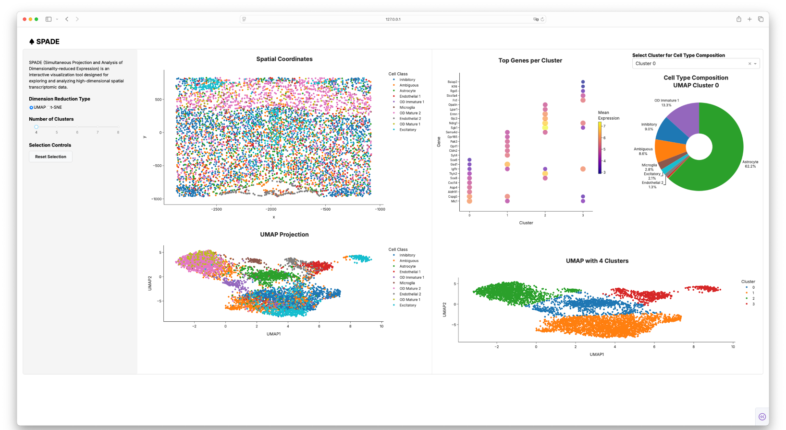

# SPADE: Spatial Transcriptomics Data Visualization Dashboard



SPADE (Simultaneous Projection and Analysis of Dimensionality-reduced Expression) is an interactive visualization tool designed for exploring and analyzing high-dimensional spatial transcriptomic data.

## Features

- **Interactive Visualizations**: 
  - Spatial coordinates plot
  - UMAP/t-SNE dimensionality reduction plots
  - Top genes per cluster bubble plot
  - Cell type composition pie charts

- **Dynamic Controls**:
  - Switch between UMAP and t-SNE visualizations
  - Adjust number of clusters (4-8)
  - Interactive point selection with linked views
  - Reset selection functionality

## Requirements

- Python 3.11.11
- Plotly 6.0.1
- Dash
- Pandas
- NumPy
- ScanPy
- Scikit-learn

## Usage

1. First, process the data:
```bash
python data_processing.py
```
This will create necessary pickle files in the `processed_data` directory.

2. Run the dashboard:
```bash
python dashboard.py
```
The dashboard will be available at `http://localhost:8050` in your web browser.

## Data Processing

The `data_processing.py` script performs the following steps:
- Loads and preprocesses the spatial transcriptomics data
- Computes UMAP and t-SNE dimensionality reductions
- Performs k-means clustering with different cluster numbers
- Generates visualization data for the dashboard
- Saves processed data as pickle files

## Dashboard Components

- **Left Panel**: Control panel for visualization options
- **Middle Panel**: Spatial coordinates and UMAP/t-SNE projections
- **Right Panel**: Top genes bubble plot and cell type composition pie chart

## Version Information

- Python: 3.11.11
- Plotly: 6.0.1
- Other dependencies are managed through pip
